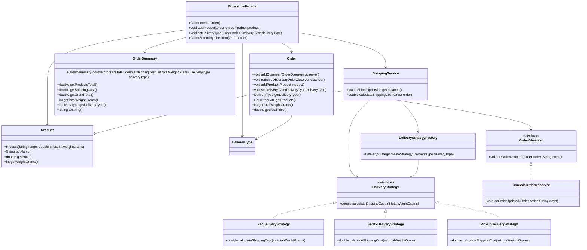

# TRABALHO 1 Análise de algoritimos

## Regras de entrega

- **PAC**: até 1 kg = R$ 10,00; 1–2 kg = R$ 15,00; acima de 2 kg não aceita.
- **Sedex**: até 500 g = R$ 12,50; 500–1000 g = R$ 20,00; acima de 1 kg = R$ 46,50 + R$ 1,50 por cada 100 g adicional.
- **Retirada**: sem custo.

## Como executar

Execute a classe `com.furb.app.Main`.

## Organização dos pacotes

- `com.furb.domain`: entidades do domínio (pedido, produto, resumo, tipo de entrega).
- `com.furb.delivery`: estratégias de cálculo e serviços de frete.
- `com.furb.observer`: observadores do pedido.
- `com.furb.facade`: fachada de acesso ao fluxo.
- `com.furb.app`: ponto de entrada.

## UML

## Testes

Os testes estão em `trabalho1/src/test/java`.
