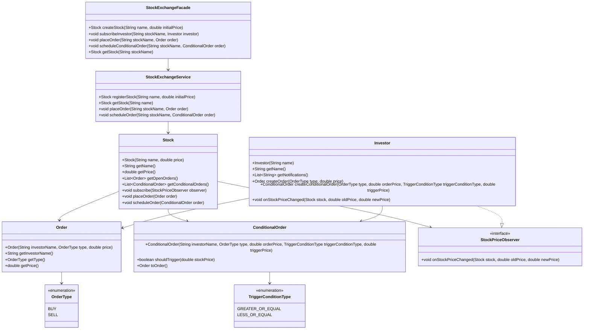

# Trabalho 1 - Problema 2

## Descrição

Simulação simplificada de bolsa de valores com:

- cadastro de ações;
- registro de ordens de compra e venda;
- match de ordens por valor;
- atualização do preço da ação pela última negociação;
- notificação de investidores inscritos;
- programação de ordens condicionadas ao valor da ação.

## Como executar

Execute a classe `com.furb.app.Main`.

## Estrutura

- `com.furb.domain`: entidades de domínio (`Stock`, `Order`, `Investor`, etc.).
- `com.furb.observer`: contrato de notificação de preço.
- `com.furb.service`: serviço de negociação.
- `com.furb.facade`: ponto de entrada simplificado da aplicação.
- `src/test/java`: testes unitários com JUnit 5.

## Diagrama de classes (UML)

