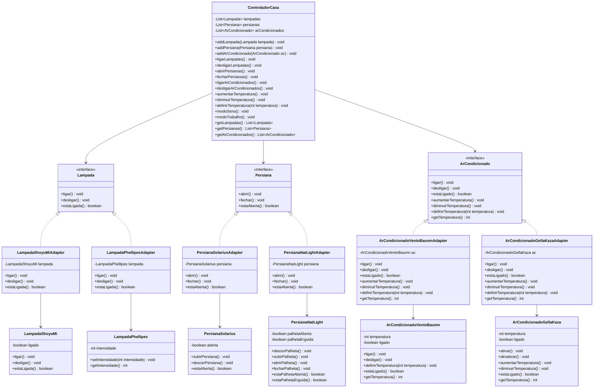

# Trabalho 1 - Problema 3

## Descrição

Sistema universal de controle de dispositivos IoT para automação residencial.
Controla persianas, lâmpadas e ar-condicionados de diferentes fabricantes de forma padronizada, utilizando o padrão **Adapter**.

Dispositivos suportados:
- **Lâmpadas**: ShoyuMi e Phellipes
- **Persianas**: Solarius e NatLight
- **Ar-condicionados**: VentoBaumn e GellaKaza

Funcionalidades:
- Controle universal de ligar/desligar, abrir/fechar, temperatura
- **Modo Sono**: desliga AC e luzes, fecha persianas
- **Modo Trabalho**: liga luzes e AC (temperatura 25), abre persianas

## Como executar

1. Coloque o arquivo `LibDispositivosIot1.0.jar` em `src/main/resources/`
2. Execute a classe `com.furb.app.Main`

## Estrutura

- `com.furb.adapter`: interfaces universais (`Lampada`, `Persiana`, `ArCondicionado`) e adapters para cada dispositivo.
- `com.furb.facade`: fachada `ControladorCasa` com controle centralizado e modos.
- `com.furb.app`: ponto de entrada.
- `src/test/java`: testes unitários com JUnit 5.

## Diagrama de classes (UML)

## Testes

Os testes estão em `trabalho3/src/test/java`.
